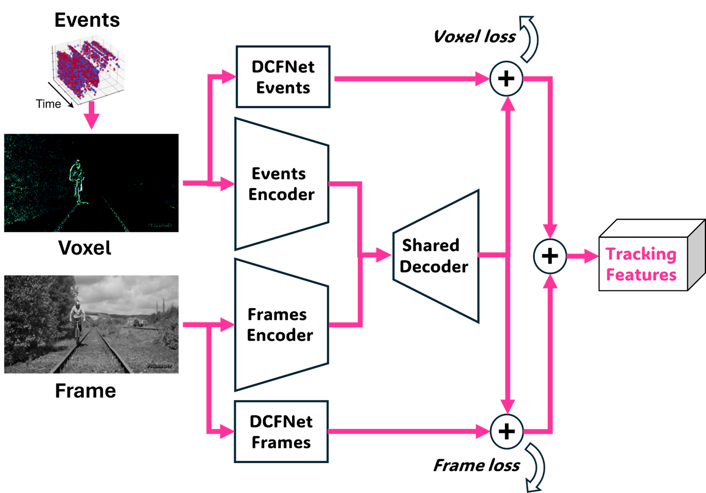
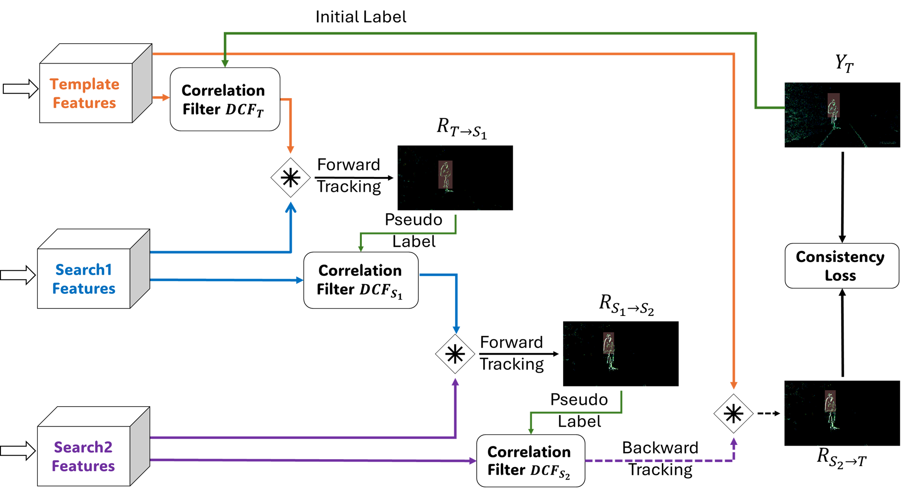

# ED-DCFNet: An Unsupervised Encoder-decoder Neural Model for Event-driven Feature Extraction and Object Tracking

<p align="center">
  
</p>

<p align="center">
  
</p>


**Title:** ED-DCFNet: An Unsupervised Encoder-decoder Neural Model for Event-driven Feature Extraction and Object Tracking

**Abstract:** Neuromorphic cameras feature asynchronous event-based pixel-level processing and are particularly useful for object tracking in dynamic environments. Current approaches for feature extraction and optical flow with high-performing hybrid RGB-events vision systems require large computational models and supervised learning which impose challenges for embedded vision and require annotated datasets. In this work we propose ED-DCFNet, a small and efficient (< 72k) unsupervised multi-domain learning framework which extracts events-frames shared features without requiring annotations with comparable performance. Furthermore we introduce an open-sourced event and frame-based dataset that captures in-door scenes with various lighting and motion-type conditions in realistic scenarios which can be used for model building and evaluation. The dataset is available at https://github.com/NBELab/UnsupervisedTracking.

**Autohrs:** Raz Ramon, Hadar Cohen-Duwek, Elishai Ezra Tsur

**Publication:** Proceedings of the IEEE/CVF Conference on Computer Vision and Pattern Recognition (CVPR) Workshops, 2024, pp. 2191-2199
([link](https://openaccess.thecvf.com/content/CVPR2024W/EVW/html/Ramon_ED-DCFNet_An_Unsupervised_Encoder-decoder_Neural_Model_for_Event-driven_Feature_Extraction_CVPRW_2024_paper.html))

## Table of Contents

1. [Requirements](#requirements)
2. [Usage](#usage)
3. [Dataset](#dataset)
4. [Citation](#citation)
5. [License](#license)

### Requirements
- Python 3.8
- pytorch > 1.0
- kornia
- dv
- tqdm

## Usage

### Tracking
1. Download the dataset from [Dataset](#dataset), and follow the readme in the data folder.

2. Navigate to the 'track' directory in the repository:

```bash
cd ./track
```

3. Run the 'track_dvs_dataset.py':

```bash
python track_dvs_dataset.py -- name XXXX
```

The testing accepts several command line arguments:
```
usage: track_dvs_dataset.py [-h] --name NAME [--weights WEIGHTS] [--data-path DATA_PATH] [--annotation-path ANNOTATION_PATH] [--data-info-path DATA_INFO_PATH] [--num-bins NUM_BINS]
                            [--track-events] [--no-track-events] [--track-frames] [--no-track-frames] [--track-combined] [--no-track-combined] [--eval-only] [-p P]

Run tracker on new dataset

optional arguments:
  -h, --help            show this help message and exit
  --name NAME           Test name
  --weights WEIGHTS     Path to model weights (default: ./models/model.pth.tar)
  --data-path DATA_PATH
                        Path to test data (default: ./data/)
  --annotation-path ANNOTATION_PATH
                        Path to annotation data (default: ./data/annotations/)
  --data-info-path DATA_INFO_PATH
                        Path to data information (default: ./data)
  --num-bins NUM_BINS, -b NUM_BINS
                        Number of temporal bins, must be the same as the network (default: 5)
  --track-events, -e    Track on events (default: True)
  --no-track-events
  --track-frames, -f    Track on frames (default: True)
  --no-track-frames
  --track-combined, -c  Track on events and frames combined (default: True)
  --no-track-combined
  --eval-only           Evaluate on previous results (default: False)
  -p P                  p (as in the paper), for reduction of frame net output (default:None)
```

The files are configured to run the tracking of the new dataset.

### Training
1. Create the training dataset

* Follow the instruction in the [Dataset](#dataset).
* Ensure that each data file is in the following format:
```
full/path/to/each/training/file.h5
```
2. Update the Config File

* Modify the data_file in the config file to reflect the correct path of the data files.
* Adjust other parameters in the config file as needed, based on the training setup described in the paper.

3. Run the Training Script

* Execute the training script using the following command:
```
python train/train.py
```
* All training parameters are specified in the config file.

5. Output Weights

* The trained weights will be saved in the /train/work/ directory.
* The naming convention for the weights is as follows:
```
{datetime}_{num_bins}.pth.tar
```
* These weights will be used for further tracking.


## Datasets
Our dataset link:([link](https://drive.google.com/file/d/1J4nt8YPFGKSW-L5MMPa-tCjsgcd9aeLF/view))

OTB2015 dataset: in order to use this, you will need to follow these instructions:
1. Download the OTB2015 dataset ([link](http://cvlab.hanyang.ac.kr/tracker_benchmark/datasets.html/)).
2. Download ROS and follow the following guide of ESIM usage: ([link](https://github.com/uzh-rpg/rpg_esim/wiki/Simulating-events-from-a-video)).
3. Convert the dataset to events using the ESIM.

Training dataset: can be found here ([link](https://github.com/TimoStoff/esim_config_generator)).

## Citation

If you use our work in your research, please cite it using the following BibTeX entry:

```bibtex
@InProceedings{Ramon_2024_CVPR,
    author    = {Ramon, Raz and Cohen-Duwek, Hadar and Tsur, Elishai Ezra},
    title     = {ED-DCFNet: An Unsupervised Encoder-decoder Neural Model for Event-driven Feature Extraction and Object Tracking},
    booktitle = {Proceedings of the IEEE/CVF Conference on Computer Vision and Pattern Recognition (CVPR) Workshops},
    month     = {June},
    year      = {2024},
    pages     = {2191-2199}
}
```

## License

MIT License

